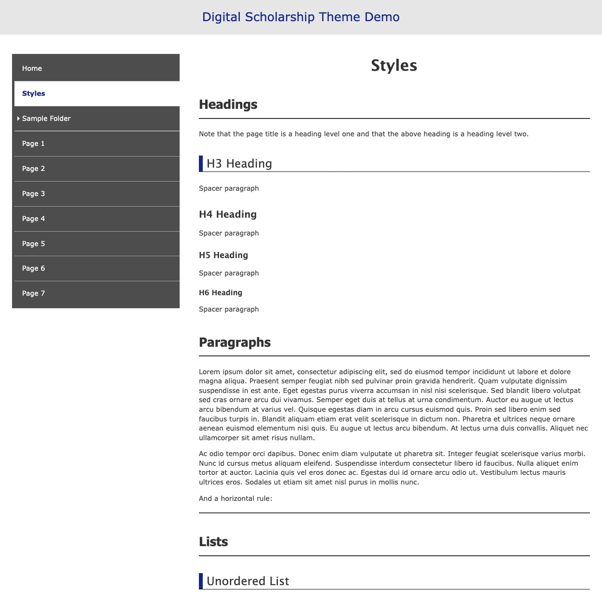

# Digital Scholarship Theme

**Digital Scholarship** is a Grav theme designed to provide a functional, if basic, Grav website that meets accessibility standards and can be extended with other themes and plugins. It is currently required in order to use the Leaflet Tour plugin.

You can see a showcase of theme styles on the [demo site](https://leaflet-tour.oucreate.com/theme-demo).

<h2 id="features">Features</h2>

- Create websites that are accessible to people with disabilities (instructions for what users need to do to ensure this are included in the [accessibility page of the Leaflet Tour documentation](https://leaflet-tour.oucreate.com/accessibility))
- Built-in template for extending theme with accessible modal dialogs
- Automatically generated sitemap creation
- Various customization options

<h2 id="requirements">Requirements</h2>

- A Grav site running Grav version 1.7.0 or higher

<h2 id="installation">Installation</h2>

Installing the Digital Scholarship theme can be done in one of two ways. The [Grav Package Manager (GPM)](https://learn.getgrav.org/cli-console/grav-cli-gpm) installation method enables you to install the theme with the admin panel or a terminal command, while the manual method enables you to do so via a zip file.

<h3 id="gpm-installation">GPM Installation (Preferred)</h3>

The simplest way to install this theme is via the admin panel, assuming you are using the admin plugin. To install, go to the Themes tab on your dashboard, click the **Add** button, look up this theme, and then click **Install**.

Alternatively, you can install this theme using your system's terminal or command line. From the root of your Grav directory type `bin/gpm install digital-scholarship`. This will install the Digital Scholarship theme into your `/user/themes` directory within Grav. Its files will be found under `your-site/grav/user/themes/digital-scholarship`.

<h3 id="manual-installation">Manual Installation</h3>

To install this theme manually:

1. Download the zip file from the [theme repository](https://github.com/oulibraries/grav-theme-digital-scholarship) or by finding the files on the [GetGrav website](https://getgrav.org/downloads/plugins).
2. Upload the file to `your-site/grav/user/themes`.
3. Unzip/extract the file.
4. Rename the folder to `digital-scholarship`.

The filepath to the theme should now be `your-site/grav/user/themes/digital-scholarship`.

<h2 id="updating">Updating</h2>

Updates to the Digital Scholarship theme may be published in the future. As with installation, you can update the theme through the Grav Package Manager (via the admin panel or your system's terminal) or manually.

Please note: Any changes you have made to any of the files in the theme will be overwritten. Any files located elsewhere (for example, a .yaml settings file placed in `user/config/themes`) will remain intact. Therefore, it is strongly discouraged to make any changes directly to theme files.

<h3 id="gpm-update">GPM Update (Preferred)</h3>

The simplest way to update this theme is via the admin panel. To do this, go to the Themes tab on your dashboard and check for updates. The dashboard will indicate if any themes have available updates and will allow you to update them individually or all at once.

Alternatively, you can update this theme using your system's terminal or command line. From the root of your Grav directory type `bin/gpm update digital-scholarship`. This will check if the Digital Scholarship theme has any updates. If it does, you will be asked whether or not you wish to update. To continue, type `y` and hit enter.

<h3 id="manual-update">Manual Update</h3>

To update this theme manually:

1. Delete the `your-site/user/themes/digital-scholarship` directory.
2. Follow the manual installation directions from this readme.
3. Clear the Grav cache by going to your root Grav directory and entering `bin/grav clear-cache` on the terminal.

Note: If you are using the admin panel, there is also a button to clear the cache in the navigation sidebar.

<h2 id="usage">Usage</h2>

To set Digital Scholarship as the default theme from the Admin panel: Go to the **Themes** section (from sidebar), find Digital Scholarship, and click **Activate**.

To set Digital Scholarship as the default theme from the file system: Find the file `your-site/grav/user/config/system.yaml` and change the `theme:` setting to `theme: digital-scholarship`. You may need to clear the Grav cache by going to your root Grav directory and entering `bin/grav clear-cache` on the terminal.

Once this is done, you should be able to see the new theme on the frontend. Keep in mind any customizations made to a previous theme will not be reflected in the new one.

The [Git Sync](https://github.com/trilbymedia/grav-plugin-git-sync) plugin is strongly recommended as a way to backup your work.

Check out the information on the [Leaflet Tour documenation site](https://leaflet-tour.oucreate.com) for full usage instructions. These instructions will also include what you need to know in order to make your site accessible to people with disabilities.

<h3 id="using-the-footer">Using the Footer</h3>

You can customize what content is provided in the footer (displayed at the bottom of every page in the site) by creating or modifying the footer page. The footer page should live under `modules`. If you do not have `modules/footer`, follow the steps below:

1. Go to the Pages tab.
2. Open the dropdown next to the **Add** button and choose **Add Folder**.
3. Name the folder `modules`.
4. Continue and save.
5. From the modules page/folder, add a new page.
    - Template: Default
    - Name: footer
6. Add whatever content you want in the site footer.
7. Save.

<h2 id="credits">Credits</h2>

- The original DS Fellowship team: Tara Carlisle, Theo Acker, Dr. Zenobie Garrett, Dr. John Stewart working with fellowship recipients Dr. Asa Randall and Laura Pott
- Primary developer: Theo Acker
- [Science Gateways Community Institute (SGCI)](https://sciencegateways.org/) for user experience consulting
- [WebAIM](https://webaim.org/) and [W3C WAI](https://www.w3.org/WAI/), both of whom greatly inspired the theme's styles and provided much-needed accessibility information

The theme uses [Fork Awesome](https://forkaweso.me/Fork-Awesome/) icons

<h2 id="contributing">Contributing</h2>

If you encounter any errors/bugs or would like to request a feature, please [open an issue on GitHub](https://github.com/oulibraries/grav-plugin-leaflet-tour/issues) or send an email to theoacker@ou.edu. You can also send an email to provide any other feedback you have. More information about collaboration options can be found on the [collaboration section of the documentation site](https://leaflet-tour.oucreate.com/home#collaboration).

This theme uses the MIT license. Feel free to modify, remix, and/or redistribute the code as long as you provide attribution to the original.
